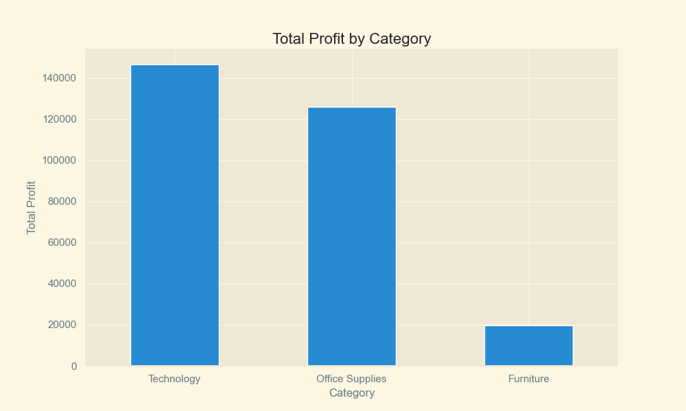
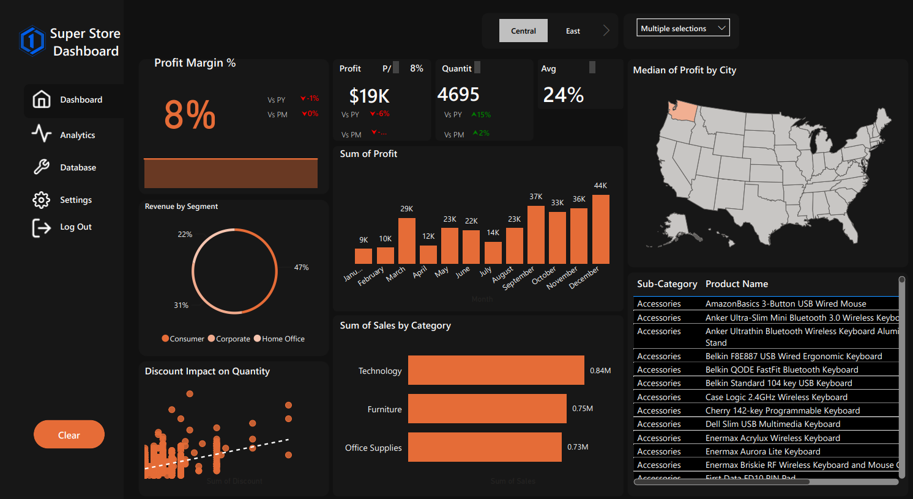

# Superstore Sales Analysis

An end-to-end **retail analytics project** using the Sample Superstore dataset to investigate sales performance, profitability, customer behavior, product performance, and regional trends.

The project combines **Python-based exploratory data analysis, SQL analysis, and Power BI visualization** to transform transactional retail data into business-oriented insights.

This project is part of my progression toward **Machine Learning Engineering**, where the focus is on building a strong foundation in data analysis, statistics, SQL, visualization, and business problem-solving before moving deeper into machine learning and production ML systems.

---

## Project Objective

The objective is to understand **what drives sales and profitability across the business** and identify patterns that could support better commercial decisions.

The analysis focuses on questions such as:

* Which categories and sub-categories generate the most sales and profit?
* Which products or areas of the business underperform?
* How do sales and profitability vary across regions and customer segments?
* How does performance change over time?
* Which customers contribute most to overall sales?
* Where are unusual or potentially problematic transactions present?
* Does strong sales performance necessarily translate into strong profitability?

---

## Analysis Workflow

The project follows a structured data-analysis workflow:

### 1. Data Understanding

* Inspected dataset structure and dimensions
* Examined data types and variable distributions
* Reviewed numerical and categorical features
* Checked for missing values and potential data-quality issues
* Generated descriptive statistics

### 2. Data Cleaning & Preparation

* Parsed and prepared date fields
* Checked data consistency
* Prepared variables for analysis
* Validated the dataset before performing deeper analysis

### 3. Outlier Detection

* Applied the **Interquartile Range (IQR)** method
* Identified unusually large transaction values
* Examined the potential impact of extreme observations on analysis

### 4. Exploratory Data Analysis

Performed univariate, bivariate, and multivariate analysis to investigate:

* Sales performance
* Profitability
* Categories and sub-categories
* Regional performance
* Customer segments
* Time-based trends
* Customer behavior
* Product performance
* Profit and loss patterns

Visualizations were created using **Matplotlib** and **Seaborn**.

### EDA Preview

<p align="center">
  
</p>

*Example visualization from the exploratory analysis.*

---

## SQL Analysis

SQL was used to approach the dataset from a more business-oriented perspective.

The analysis includes:

* Data exploration
* Sales and profit analysis
* Customer analysis
* Product and category analysis
* Aggregations and ranking
* Supporting analysis for future machine-learning work

The SQL work is organized into separate scripts under the `sql/` directory.

---

## Power BI Dashboard

The analysis was also translated into an interactive **Power BI dashboard** designed to provide a business-facing view of the dataset.

The dashboard brings together key areas including:

* Sales performance
* Profitability
* Customer segments
* Product and category performance
* Regional performance
* Business KPIs

### Dashboard Preview

<p align="center">
  
</p>

*Power BI dashboard developed from the Superstore analysis.*

The `.pbix` file is included in the repository for reference.

---

## Key Business Questions

The project is designed around business questions rather than visualization alone:

| Area          | Question                                                    |
| ------------- | ----------------------------------------------------------- |
| Sales         | Where is revenue being generated?                           |
| Profitability | Which areas generate or destroy profit?                     |
| Products      | Which products and sub-categories perform best?             |
| Customers     | Which customer segments and customers contribute most?      |
| Geography     | How does performance differ across regions?                 |
| Time          | How does business performance change over time?             |
| Risk          | Where do unusual transactions or weak profitability appear? |

---

## Key Findings

The analysis is used to identify:

* Differences between **sales performance and profitability**
* Categories and sub-categories with stronger or weaker financial performance
* Regional and customer-segment differences
* Important customer and product contributions
* Time-based changes in sales and profit
* Transactions requiring additional investigation because of extreme values or unusual profitability

> Detailed findings are derived directly from the analysis and visualizations rather than being predetermined.

---

## Business Recommendations

Based on the analytical framework, the project can support decisions such as:

* Investigating products with strong sales but weak profitability
* Reviewing discounting strategies where discounts negatively affect margins
* Identifying high-value customers and customer segments
* Investigating underperforming regions and product categories
* Monitoring unusually large transactions and extreme observations
* Evaluating products using **profitability as well as sales volume**

---

## Project Structure

```text
superstore-sales-analysis/
│
├── .gitignore
├── .vscode/
│   └── settings.json
│
├── data/
│   └── samplesuperstore.csv
│
├── images/
│   ├── Profit_Category.png
│   └── superstore_final_pibx.png
│
├── sql/
│   ├── 01_setup.sql
│   ├── 02_data_exploration.sql
│   ├── 03_sales_profit_analysis.sql
│   ├── 04_customer_analysis.sql
│   └── 05_ml_supporting_analysis.sql
│
├── src/
│   ├── clustering.py
│   ├── data_preparation.py
│   ├── eda.py
│   ├── evaluation.py
│   └── sup_unsup_vised.py
│
├── main.py
├── samplesuperstore.csv
├── requirements.txt
└── README.md
```

> `__pycache__/` is omitted from the documented project structure because it contains Python-generated cache files and is not part of the project's analytical source code.

---

## Tech Stack

### Data Analysis

* Python
* pandas
* NumPy
* Statistics

### Visualization

* Matplotlib
* Seaborn
* Microsoft Power BI

### Data & Querying

* SQL

### Development & Version Control

* Git
* GitHub
* VS Code

---

## Setup

Clone the repository:

```bash
git clone https://github.com/EmperorZhuoFan/superstore-sales-analysis.git
cd superstore-sales-analysis
```

Install the required Python dependencies:

```bash
pip install -r requirements.txt
```

Run the main project:

```bash
python main.py
```

SQL analysis scripts can be found in:

```text
sql/
```

The Power BI dashboard is available as:

```text
superstore_analysis.pbix
```

---

## What I Learned

This project strengthened my ability to:

* Work with real-world tabular datasets
* Use pandas for data preparation and analysis
* Apply descriptive statistics
* Detect and investigate outliers
* Perform univariate, bivariate, and multivariate analysis
* Build meaningful data visualizations
* Use SQL for business-oriented data analysis
* Translate analytical results into business questions
* Build a Power BI dashboard
* Organize a multi-component data project with Git and GitHub
* Think about **why an analysis matters**, not only how to perform it

---

## Project Status

**Completed — September 2026**

This project represents my current data-science foundation stage and serves as a practical bridge toward machine-learning development.

---

## Roadmap

| Stage         | Focus                                                         |
| ------------- | ------------------------------------------------------------- |
| **Completed** | Python, pandas, statistics, SQL, EDA, visualization, Power BI |
| **Next**      | Machine Learning and model development                        |
| **Later**     | MLOps, MLflow, Docker, DVC, CI/CD, model monitoring           |
| **Future**    | Deep Learning, PyTorch, NLP, Transformers                     |
| **Future**    | LLM foundations, fine-tuning, evaluation, Hugging Face        |

---

## Author

**Omar Moneim**

Computer Science Student | Aspiring Machine Learning Engineer

[GitHub](https://github.com/EmperorZhuoFan) · [Portfolio](https://emperorzhuofan.github.io)
